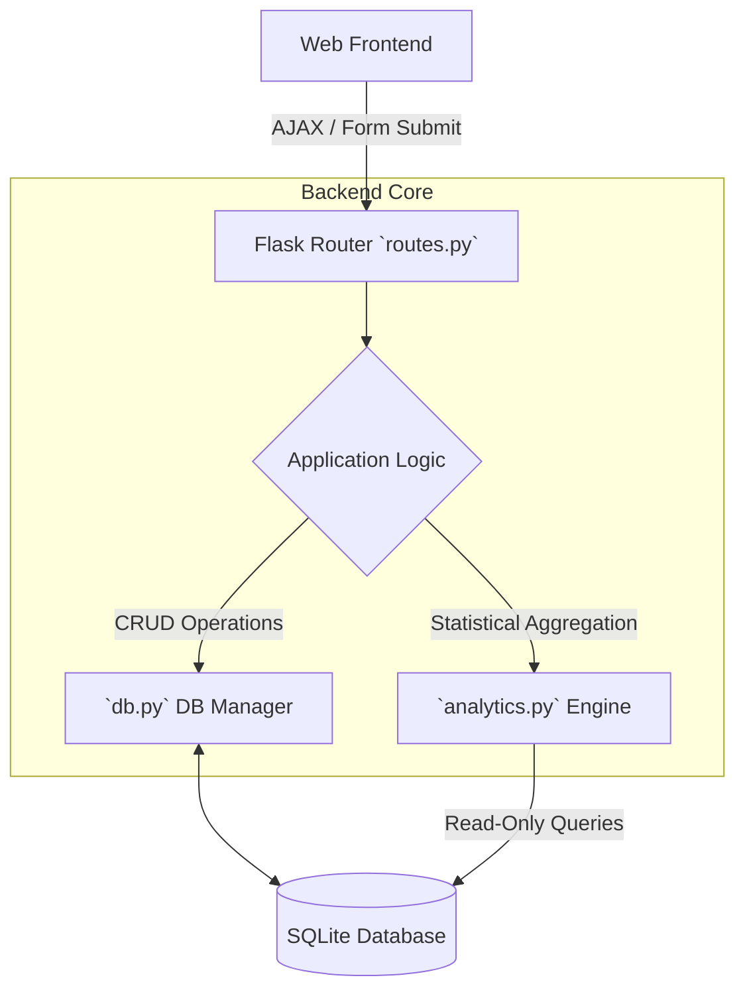
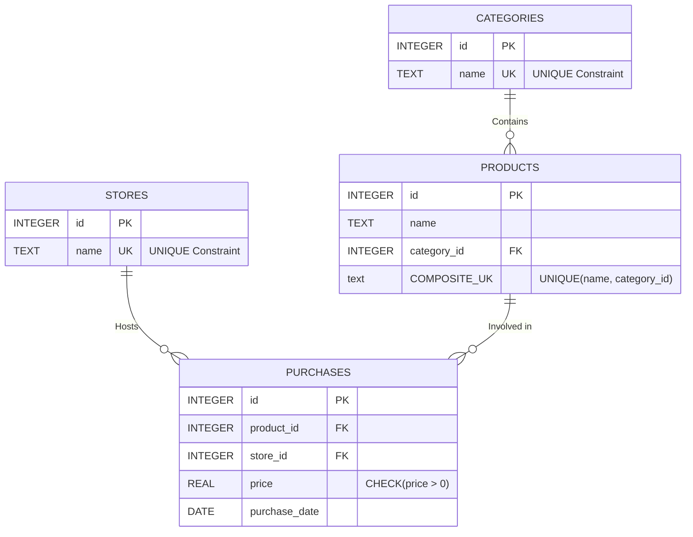

# 🛒 Personal Grocery & Expense Optimizer

[](https://www.python.org/)
[](https://flask.palletsprojects.com/)
[](https://www.sqlite.org/)
[](https://developer.mozilla.org/)
[](https://render.com/)

A professional, full-stack web application engineered to meticulously track grocery expenses, manage product inventories, and deliver actionable financial insights. Built with **Flask** and **SQLite**, it features a modern, responsive Glassmorphism UI and a highly optimized data architecture.

<a href="https://drive.google.com/file/d/1q7UMnhD5hUFBpPxcbDrGIjJOGl4iDf7I/view?usp=drive_link" target="_blank">**👉 View KPI Dashboard Preview**</a> | <a href="https://drive.google.com/file/d/1fXYyc3E6smTQ3lx-R-0xio7smt0_NRXD/view?usp=drive_link" target="_blank">**👉 View Analytics & Trends Preview**</a>

---

## 📌 Executive Summary & Core Features

- **Advanced Analytics Engine**: Dynamic data aggregation powering real-time KPIs (Total Spent, Average Purchase Price) and interactive **Chart.js** visual distributions.
- **Robust Data Integrity**: Enforces strict structural integrity at the SQLite level using `NOT NULL`, `UNIQUE`, and `CHECK` constraints to ensure flawless data quality.
- **Composite Validation Logic**: Sophisticated backend validation allowing identically named products to exist safely across different categories (e.g., "Apple" in *Fruits* vs. *Frozen*) while blocking intra-category duplicates.
- **Premium User Experience**: Responsive Vanilla CSS3 design featuring inline editing capabilities and non-intrusive, context-aware error messaging.
- **Zero-Config Deployment**: Optimized for cloud platforms (like Render) with automatic database initialization and synthetic data seeding on fresh environments.

---

## 🗺️ System Architecture

The application implements a clean Model-View-Controller (MVC) pattern, decoupling the data layer, analytical engine, and frontend presentation:



---

## 📊 Relational Database Design

The backend relies on a strictly typed relational schema designed for high-performance querying and zero data redundancy:



### 🗄️ Schema Breakdown
1. **`stores`**: Lookup table for retail locations.
2. **`categories`**: Taxonomy mapping for grocery items.
3. **`products`**: Inventory master list. Uses a **Composite Unique Constraint** to enforce logical naming without over-restricting generic items.
4. **`purchases`**: The central Fact Table logging transaction history, amounts, and relational keys.

---

## ⚙️ Application Components Deep-Dive

### 1. 📈 Analytics Engine (`analytics.py`)
Processes raw transaction data into human-readable insights. It dynamically constructs parameterized `WHERE` clauses based on user filters (Date ranges, specific Stores, or Categories) to generate arrays mapped directly to Chart.js datasets.

### 2. 🛡️ Data Validation & DAO (`db.py`)
Acts as the sole Data Access Object. Every `add_` or `update_` function returns a strict `(success_boolean, error_message)` tuple. It intercepts raw SQLite `IntegrityError` exceptions and translates them into actionable user-facing messages.

### 3. 🌱 Smart Seeding (`seed_data.py`)
If the application detects an empty deployment environment, the `init_db()` factory automatically executes a smart seed. It populates 10 Stores, 11 Categories, 61 Products, and **250 randomized purchase records** spanning 6 months to immediately activate the analytics dashboard.

---

## 🚀 Quick Start Setup & Deployment

### Local Installation

1. **Clone the repository**:
   ```bash
   git clone https://github.com/alonsobern/grocery-expense-optimizer.git
   cd grocery-expense-optimizer
   ```

2. **Create a virtual environment**:
   ```bash
   python -m venv venv
   source venv/bin/activate  # On Windows: venv\Scripts\activate
   ```

3. **Install dependencies**:
   ```bash
   pip install -r requirements.txt
   ```

4. **Launch the application**:
   ```bash
   python run.py
   ```
   *The database will auto-initialize and seed itself on startup. Access the app at `http://127.0.0.1:5000`.*

### Cloud Deployment (Render)
This project is configured for immediate deployment. The `requirements.txt` is stripped of local OS dependencies and features `gunicorn`.
*   **Build Command**: `pip install -r requirements.txt`
*   **Start Command**: `gunicorn "app:create_app()"`

---

## 📂 Repository Blueprint

```text
├── app/
│   ├── static/                  # CSS styling (Glassmorphism), JS, and Images
│   ├── templates/               # Jinja2 HTML Templates (base, index, reports, etc.)
│   ├── analytics.py             # Data processing and reporting logic
│   ├── db.py                    # Database CRUD, Validation, and Initialization
│   ├── routes.py                # Flask view controllers
│   └── __init__.py              # App factory
├── database/
│   ├── schema.sql               # Database table definitions & constraints
│   └── grocery.db               # SQLite Database (Auto-generated on launch)
├── docs/                        
│   └── development_chronology.md   # AI Pair-Programming workflow logs
├── requirements.txt             # Production dependencies (Flask, Gunicorn)
├── run.py                       # Local development entry point
└── seed_data.py                 # Standalone manual synthetic data generator
```

---

## 🤝 Collaborative Development & AI Pair-Programming History

This application was meticulously built utilizing an advanced agentic AI pair-programming workflow. The entire step-by-step evolution of the codebase is documented for transparency and educational review:

*   **[AI Collaborative Chronology](docs/development_chronology.md)**: A detailed breakdown of the 57 unique development requests, architectural shifts (e.g., migrating to Application Factories), and the implementation of the composite database validation.

## 📄 License

Distributed under the MIT License. See `LICENSE` for more information.
