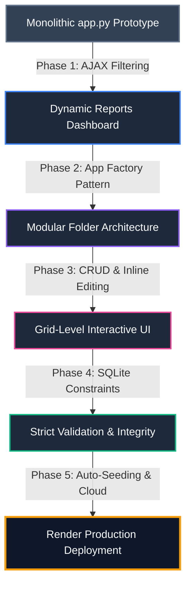

# 🛠️ AI-Collaborative Development Chronology

This document details the complete step-by-step collaborative development history of the **Personal Grocery & Expense Optimizer** application. Built via pair-programming between the developer and **Antigravity** (an advanced agentic AI coding assistant designed by Google DeepMind), the project evolved from a simple single-file prototype into a highly robust, modular, production-ready full-stack application.

The entire raw transcript of this multi-session development process (consisting of all prompts, reasoning, tool executions, and file diffs) is preserved inside this repository at [`docs/conversation_transcript.jsonl`](file:///c:/Users/westm/iCloudDrive/Documents/PORTFOLIO/Web%20Developer/Personal%20Grocery%20&%20Expense%20Optimizer/docs/conversation_transcript.jsonl).

---

## 📅 Architectural Evolution & Milestones

The project was implemented across five key evolutionary phases, representing 57 distinct development requests:



---

## 📑 Detailed Chronological Breakdown

### 📊 Phase 1: Dashboard Analytics & AJAX Filtering
**Core Focus:** Enhancing user insights by introducing complex data-filtering and asynchronous UI updates.
*   **False-Positive Linter Resolve:** Diagnosed and documented that editor errors (like `',' expected`) in `<script>` blocks were parser synchronization errors caused by Jinja2 template braces (`{{ ... | tojson }}`) rather than syntax issues.
*   **Filter UI Card:** Added a clean date range, store, and category filtering control card at the top of the reports page, assigning dedicated IDs to every input.
*   **Asynchronous Analytics API:** Implemented a new JSON endpoint `/api/reports` in the Flask backend that dynamically builds safe parameterized SQL `WHERE` clauses for any combination of `start_date`, `end_date`, `store_id`, and `category_id` parameters.
*   **Dynamic AJAX Refresh:** Wrote pure JavaScript utilizing `fetch()` to call the reports API on filter submission. It dynamically updates dashboard KPI cards (Total Spend, Weekly, Monthly) and recalculates/updates three independent Chart.js instances (Store totals, Category spend, Monthly trends) in real time without refreshing the browser page.

---

### 📦 Phase 2: Professional Flask Architectural Refactoring
**Core Focus:** Transitioning the codebase from a single monolithic script into an enterprise-grade modular package.
*   **Application Factory Pattern:** Replaced direct Flask instantiation with a clean modular structure initialized in `app/__init__.py` using Blueprint routing.
*   **Separation of Concerns:** 
    *   `app/db.py`: Centralized SQLite connection management and absolute database path resolution.
    *   `app/analytics.py`: Encapsulated mathematical aggregation queries and KPI calculations.
    *   `app/routes.py`: Reconfigured as a clean controller layer that decodes requests, invokes business logic, and outputs templates or JSON responses.
    *   `run.py`: Created a lightweight application entry point.

---

### ✏️ Phase 3: Dynamic Inline Table Editing & CRUD
**Core Focus:** Transforming static HTML data displays into interactive spreadsheets directly within the DOM.
*   **Full CRUD Mechanics:** Added add-forms and clean delete endpoints for stores, categories, products, and purchases.
*   **Delete Safeguards:** Enforced dependency validation checks (e.g., preventing deletion of a store that contains historical purchases, or a category containing active products) and introduced clean red-styled confirmation buttons.
*   **Inline Editing Engines:** Replaced standard text table cells with interactive inputs and dropdowns when "Edit" is activated:
    *   Stores and categories edit names.
    *   Products edit names and re-assign categories via dynamic selectors.
    *   Purchases support full date-pickers, store selectors, product selectors, and price inputs.
*   **UX Enhancements & Icon Buttons:**
    *   Optimized column spacing to prevent layout shifting during edit transitions.
    *   Refactored text buttons into circular, compact emojis (`✏️`, `✔`, `✖`, `🗑`) to save horizontal space.
    *   Enforced a single-row active edit constraint to prevent conflicting DOM states.
    *   Styled all selects and inputs to perfectly inherit dark-theme variables (#1e293b background, rounded borders).

---

### 🛡️ Phase 4: Strict SQLite Data Integrity & Validations
**Core Focus:** Building double-layered (frontend + backend) validations to ensure pristine, error-free databases.
*   **Foreign Key Constraint Enforcement:** Enabled `PRAGMA foreign_keys = ON;` in `app/db.py` to prevent orphaned database records.
*   **Double-Layer Form Validations:** Implemented required fields in form templates alongside rigid validations in Python route endpoints, delivering error feedback natively in-page without using browser dialog alerts.
*   **Refactored Uniqueness Rules:** Discovered that a global uniqueness rule on product names blocked valid multi-category items (e.g., "Apple" in Fruits vs. "Apple" in Frozen). Designed and updated the SQLite schema to use a **Composite Unique Constraint** `UNIQUE(name, category_id)` to allow cross-category product naming while preventing duplicate entries under the same category.

---

### ☁️ Phase 5: Cloud Optimization & Automatic Seeding
**Core Focus:** Tuning dependencies and setup scripts for zero-configuration, instant-on cloud deployment.
*   **Dependency Standardization:** Stripped all platform-specific packages (e.g., `pywin32`) from `requirements.txt` to guarantee seamless compatibility with Linux hosts.
*   **Automatic Database Provisioning:** Configured `create_app()` to automatically create the SQLite directory structure and execute the schema initialization script (`schema.sql`) on start if no database file is present.
*   **Intelligent Synthetic Seeding:** Programmed an automatic seeding system that runs during initial deployment if the `purchases` table is empty. The utility builds a complete dataset:
    *   **7 Stores** (Trader Joe's, Whole Foods, Costco, etc.)
    *   **7 Categories** (Produce, Bakery, Dairy, etc.)
    *   **30+ Products**
    *   **150+ Purchases** spread realistically across the last 6 months to instantly populate the dashboard analytics.

---

## 🔍 How to Read the Raw Conversation Logs

The raw conversation file `docs/conversation_transcript.jsonl` contains the exact history of the AI assistant's execution steps. Each line in this JSONL file is a single JSON object containing detailed data about a conversation step.

### 💡 Example: Extracting User Requests via Python

To quickly review or print every unique request from the log, you can use the following lightweight Python script:

```python
import json
import re

log_path = "docs/conversation_transcript.jsonl"

with open(log_path, 'r', encoding='utf-8') as f:
    for line in f:
        try:
            step = json.loads(line.strip())
            if step.get("source") == "USER_EXPLICIT" and step.get("type") == "USER_INPUT":
                content = step.get("content", "")
                # Find <USER_REQUEST> tags
                match = re.search(r"<USER_REQUEST>(.*?)</USER_REQUEST>", content, re.DOTALL)
                if match:
                    print(f"\n[Step {step['step_index']}] Request:\n{match.group(1).strip()}")
        except Exception:
            pass
```

This log provides full accountability and transparency for the AI pair-programming process, serving as an outstanding portfolio artifact that demonstrates advanced software engineering coordination.
